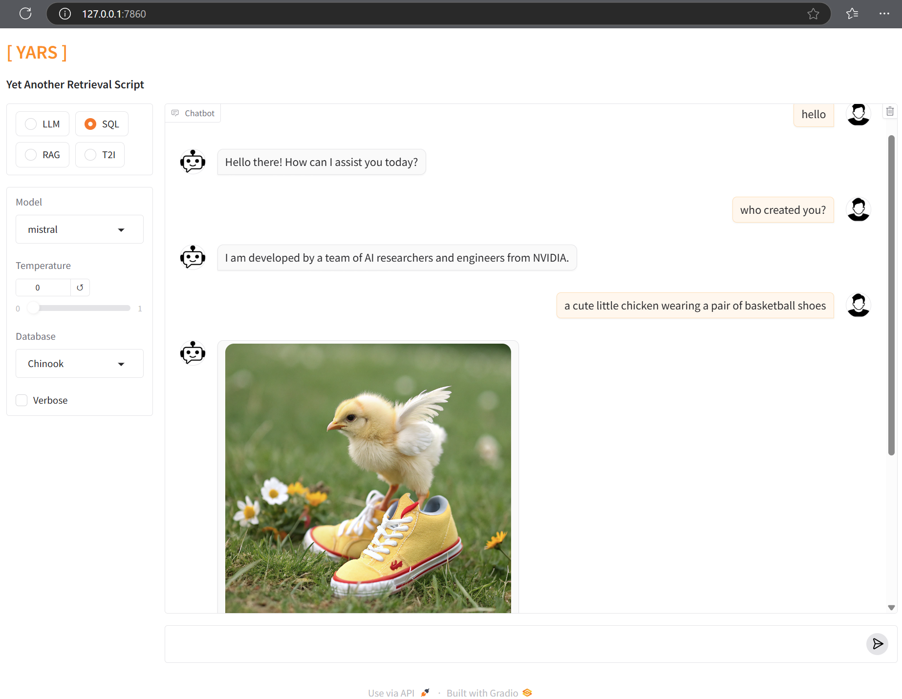

# YARS
Yet Another Retrieval Script

The main goal of this especific branch of YARS is to share a light-weight but powerful and open-source base for people to talk with an SQL database and find information directly by asking questions in natural language. The core components of this chatbot are **ollama** and **langchain** libraries, both **free** to use! The main advantage of this implementation is the possibility to choose from a list of different **LLM** models provided by Ollama. You are in control of which models you want to run locally!

**YARS** will continue to grow with more functionality, with the target audience being the scientific community. I'll write more about my personal short- and long-term goals of this *chatbot* soon :)

## Getting Started

These instructions will get you a copy of the project up and running on your local machine for development and testing purposes.

### Prerequisites

- **YARS** is developed with **Python**, so we start there and it is assumed that you have a working version of Python in your system. If not, then I recommend to follow the instructions from the [Python](https://www.python.org/) website. There are also thousands of tutorials on the web, one I recommend is [The Hitchhiker's Guide to Python](https://docs.python-guide.org/starting/installation/#installation). Go for **Python 3.8** or newer!

    Verify that Python is running with:
    ```
    python --version
    ```
    The output should return the version of the Python libraries installed in your system. Verify also that the package installer for Python, [PIP](https://pip.pypa.io/en/stable/installation/) is installed.

- You'll need to have the Ollama server running in your machine:

    1. Download [Ollama](https://ollama.com/download), and follow their instructions for installation in your local machine.
    2. Make sure the Ollama server is running.
    3. Visit Ollama's [Models](https://ollama.com/library) for a list of available models.
    4. Open a terminal and download your favorite models with: `ollama run model-name`

- We will be working with **PostgreSQL** as the main database server for this example. Using other database flavours will require you to check and adapt the creation of the *SQLDatabse* instance with the right **URI** syntax for your database.
    You will also need to edit the SQL queries inside the *utils/sql_examples.json* file so that it follows the correct syntax of your SQL commands.

    In this example we'll be using the [**Chinook**](https://github.com/lerocha/chinook-database) database. The Chinook database can be recreated locally by downloading the respective SQL script from [here](https://github.com/lerocha/chinook-database/releases). In case you want to work with a different database you will need to carefully curate the examples of **question + SQL query** inside the *utils/sql_examples.json* file for better accuracy in the interaction with the LLM.

### Installing YARS

- First, download the repository as a [ZIP file](https://github.com/apolo74/YARS/archive/refs/heads/main.zip) or (assuming you have already installed the github package) just open a terminal and `git clone` it. Go inside the **YARS** folder and I recommend to work under a virtual environment; create one and activate it before installing the requirements:
    ```
    python -m venv .venv
    ```
- Activate the environment:
    > Windows:
        ```
        .\.venv\Scripts\activate
        ```

    > Linux: 
        ``` 
        source ./.venv/bin/activate 
        ```

- All the required dependencies are listed inside the *requirements.txt* file. To install them just run:
    ```
    python -m pip install -r requirements.txt
    ```

- The generation of images works with PyTorch and it is computationally expensive. Ideally you'll have this repository running on a powerful enough system with a GPU. You'll find a configuration tool at this [PyTorch URL](https://pytorch.org/get-started/locally/#start-locally), select *Your OS* and your *Compute Platform*. Copy the final command at the bottom of the configuration tool and run it after the previous step. As an example of a Windows OS and CUDA 12.4 I'd run the following line:
    ```
    pip install torch torchvision torchaudio --index-url https://download.pytorch.org/whl/cu124
    ```

- Finally, the file *utils/.env_example* contains the variables necessary to connect to your database. You should either edit and rename that file into *utils/.env* or create a new file named *utils/.env* with the correct values.

## Execution
- To start interacting with your databases, just run the call the *main.py* script inside a terminal.
    ```
    python app.py [-h]
    ```
- The script will give you access to a link at your localhost on port 7860 (http://127.0.0.1:7860) assuming you work with Gradio's default values. Just open your favorite browser and write that address in the URL field. Follow the instructions and enjoy!


